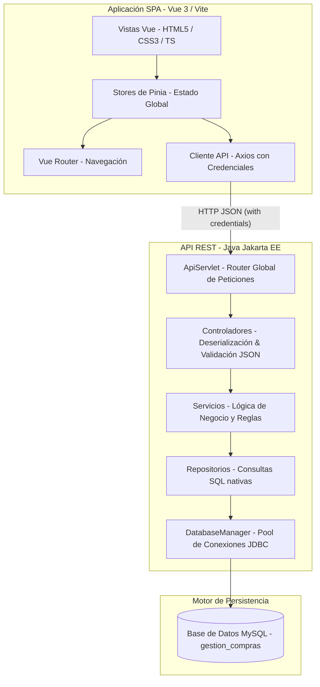
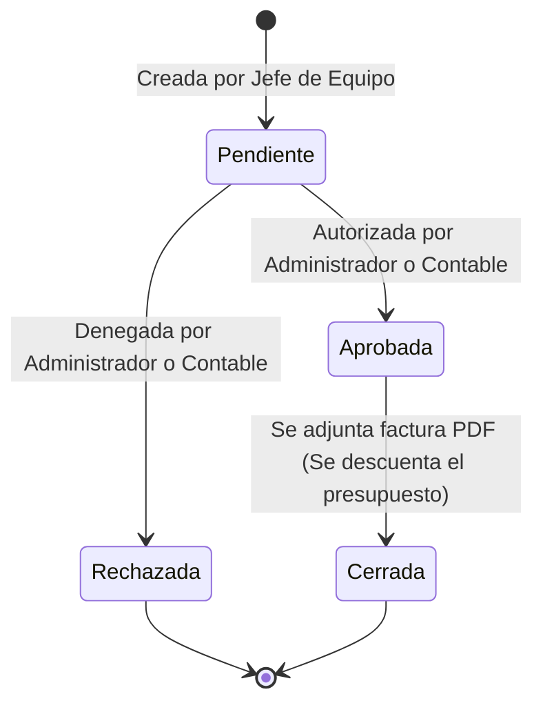

# ZarGestion 🪙 - Plataforma Integral de Gestión de Compras y Presupuestos

¡Bienvenido a **ZarGestion**! Una plataforma web empresarial avanzada y de alto rendimiento diseñada para la planificación, control y seguimiento de presupuestos de inversión y gastos corrientes departamentales, junto con la gestión del ciclo de vida de órdenes de compra y la auditoría digital de facturas.

Este repositorio está organizado como un **monorregistro (monorepo)** compuesto por:
1. **`front/`**: Una SPA (Single Page Application) moderna construida con **Vue 3**, **TypeScript**, **Pinia** y **Vite**.
2. **`back/`**: Una API robusta basada en **Java Servlets (Jakarta EE)**, arquitectura multicapa (Controller-Service-Repository) y persistencia nativa con **MySQL**.

---

## 🗺️ Arquitectura General del Sistema

ZarGestion implementa una arquitectura desacoplada donde el frontend consume servicios REST del backend mediante llamadas seguras, mientras que el backend interactúa con un motor relacional MySQL altamente optimizado.



---

## 🛠️ Stack Tecnológico Utilizado

### **Frontend**
*   **Vue 3 (Composition API)**: Framework de frontend progresivo y reactivo para una experiencia de usuario fluida.
*   **TypeScript**: Tipado estático para garantizar la robustez del código y evitar errores en tiempo de ejecución.
*   **Pinia**: Gestor de estado global y reactivo, ideal para sincronizar el estado del usuario, presupuestos y órdenes de compra.
*   **Vite**: Herramienta de compilación ultrarrápida y entorno de desarrollo con Hot Module Replacement (HMR).
*   **PDF.js**: Motor de renderizado en canvas de archivos PDF para la visualización de facturas directamente en el navegador.

### **Backend**
*   **Java SE 21 & Jakarta Servlet (API Servlets)**: Núcleo de la API para procesar peticiones web de forma nativa e independiente, reduciendo la sobrecarga de frameworks pesados.
*   **JDBC (Java Database Connectivity)**: Persistencia nativa y de alta velocidad sin la sobrecarga de un ORM pesado.
*   **MySQL Server**: Base de datos relacional robusta con transacciones ACID para la gestión financiera.
*   **Jackson API**: Procesamiento eficiente de serialización y deserialización de JSON.

---

## 📈 Flujos Principales de la Aplicación

### 1. Gestión de Presupuestos (Presupuesto Ordinario vs. Plan de Inversión)
ZarGestion distingue estrictamente entre presupuestos corrientes (**Presupuesto ordinario**) y presupuestos específicos de capital (**Plan de Inversión**):
*   **Generación de Códigos**: Los códigos se autogeneran según el formato normalizado:
    *   *Presupuesto*: `PRES-[DEPARTAMENTO]-[AÑO]`
    *   *Plan de Inversión*: `PLAN-[DEPARTAMENTO]-[AÑO]`
*   **Unicidad Estricta**: La base de datos y la lógica de negocio prohíben estrictamente tener más de un presupuesto de cada tipo por departamento en el mismo año fiscal.

### 2. Ciclo de Vida de las Órdenes de Compra
Las órdenes pasan por un flujo de aprobación estricto:


### 3. Carga y Visor Inteligente de Facturas
*   **Carga Directa**: Al adjuntar una factura a una orden aprobada, el backend la recibe como un flujo binario multipart y la almacena directamente en la base de datos como un `BLOB` (Binary Large Object).
*   **Visor de PDF con Bloqueo de Scroll**: Un componente visual avanzado interactivo renderiza la factura usando `PDF.js`. El scroll de la página de fondo se bloquea de forma inteligente para permitir una experiencia de lectura de PDF impecable.
*   **Descargas Seguras**: Implementado con políticas seguras de cookies CORS (`Credentials: include`), garantizando la autenticidad del usuario en cada descarga.

---

## 🚀 Guía de Despliegue Local Rápido

### **Paso 1: Configurar la Base de Datos**
1. Abre tu gestor de base de datos MySQL (por ejemplo, phpMyAdmin o MySQL Workbench).
2. Crea una base de datos llamada `gestion_compras`.
3. Importa el archivo de base de datos ubicado en: `/back/gestion_compras.sql`.

### **Paso 2: Iniciar el Backend**
1. Asegúrate de tener instalado Java Development Kit (JDK 17 o superior) y Apache Tomcat (versión 10.x).
2. Configura los parámetros de conexión en [db.properties](file:///z:/ProyectoDAM/back/src/main/java/db.properties).
3. Compila y despliega el proyecto en tu servidor Tomcat. La API estará expuesta en `http://localhost:8080/backend/api`.

### **Paso 3: Iniciar el Frontend**
1. Accede a la carpeta `/front`.
2. Instala las dependencias necesarias:
   ```sh
   npm install
   ```
3. Inicia el servidor de desarrollo local:
   ```sh
   npm run dev
   ```
4. Abre tu navegador en la ruta indicada por Vite (normalmente `http://localhost:5173`).

---

## 🔒 Seguridad y Roles de Usuario
El sistema se rige bajo un modelo estricto de **Control de Acceso Basado en Roles (RBAC)**:
*   **Administrador**: Control total sobre presupuestos, usuarios, asignación departamental e informes globales.
*   **Contable**: Gestión financiera, aprobación o rechazo de solicitudes de compra y visualización de facturas.
*   **Jefe de Equipo**: Creación de órdenes asociadas al presupuesto disponible de su departamento. No puede ver datos de otros departamentos.

---
*Desarrollado bajo los más estrictos estándares de ingeniería de software para el módulo de Proyecto de Grado Superior DAM.*
